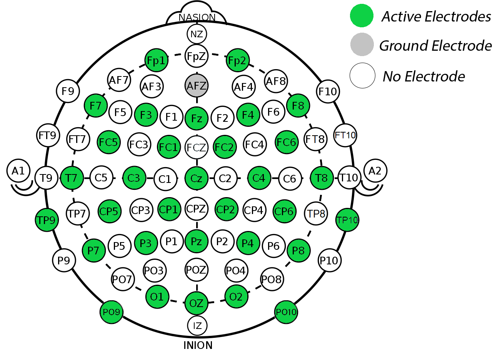
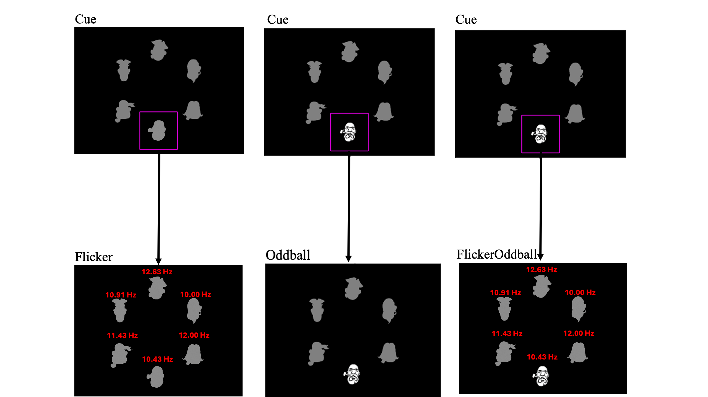

# Dataset Description

## Table of Contents
- [Dataset Description](#dataset-description)
  - [Table of Contents](#table-of-contents)
  - [Overview](#overview)
  - [Your Goal](#your-goal)
    - [Key Considerations:](#key-considerations)
- [📂 The Dataset](#-the-dataset)
  - [Data Acquisition](#data-acquisition)
  - [Stimuli \& Setup](#stimuli--setup)
  - [Experimental Design](#experimental-design)
    - [General Structure](#general-structure)
    - [`Oddball` Task – Event-Related Potentials (ERP)](#oddball-task--event-related-potentials-erp)
    - [`Flicker` Task – Steady-State Visual Evoked Potentials (SSVEP)](#flicker-task--steady-state-visual-evoked-potentials-ssvep)
    - [`FlickerOddball` Task – SSVEP \& ERP Hybrid](#flickeroddball-task--ssvep--erp-hybrid)
  - [Event Markers](#event-markers)
    - [Oddball Task](#oddball-task)
    - [Flicker Task](#flicker-task)
    - [FlickerOddball Task](#flickeroddball-task)
    - [Usage](#usage)
  - [📂 Data Files \& Download](#-data-files--download)
    - [Dataset Structure](#dataset-structure)
- [Resources](#resources)
    - [Electrode Montage](#electrode-montage)
    - [Paradigm Example](#paradigm-example)


## Overview  
This dataset comprises EEG recordings from **10 participants**, each subjected to three experimental tasks designed to elicit specific neural responses: **Oddball, Flicker, and FlickerOddball**. The objective was to study and use **Event-Related Potentials (ERP)** and **Steady-State Visual Evoked Potentials (SSVEP)** for classification. The dataset includes **EEG recordings, event markers, and metadata** to support further analysis.  

| **Condition**    | **Response Type**               |
|-----------------|---------------------------------|
| Oddball         | ERPs (P300, N170)               |
| Flicker         | SSVEP (At 6 frequencies)        |
| FlickerOddball  | SSVEP & ERPs (Hybrid)           |

---

## Your Goal
Your task is to develop a **machine learning model** or a **data cleaning pipeline** (or both!) to classify:  
- **Target vs. Non-Target Stimuli** in the **Oddball / FlickerOddball** tasks.  
  - Using ERPs (and SSVEPs in FlickerOddball)
- **Attended Frequency** in the **Flicker** task.  
  - Using SSVEPs

### Key Considerations:
- **Creative ideas are encouraged!** If you have an alternative research question using this dataset, go for it—just be prepared to justify it.  
- **Preprocessing is crucial!** The dataset is raw, meaning artifact removal, filtering, and feature extraction may be necessary for good results.
- **Justify your approach.** You can use any ML model, preprocessing, or feature engineering method, but you must explain your choices.  

---

# 📂 The Dataset  

## Data Acquisition 
- **EEG Channels:** 32 wet electrodes in [10-20 standard layout (Easycap M1)](#electrode-montage).  
  - Already **re-referenced to the average of all channels**.  
  - The correct **montage is preset**. 
- **EOG Channel:** 1 channel (⚠️ **Noisy—avoid using it for ML!**)  
- **Sampling Rate:** 1000 Hz

---

## Stimuli & Setup
- **Stimulus Type:** Cartoon pirate faces (gray silhouettes or white faces).  
- **Presentation:** Stimuli were displayed in a circle around the screen center.  
- **Indexing:** Each stimulus has an index [0-5], starting from the top, moving clockwise.  

| **Index** | **Frequency (Hz)** |
|----------|------------------|
| 0        | 12.63           |
| 1        | 10.00           |
| 2        | 12.00           |
| 3        | 10.43           |
| 4        | 11.43           |
| 5        | 10.91           |

---

## Experimental Design
Each participant performed **three tasks**, structured into **trials** and **blocks**.
[Click here](#paradigm-example) or see #Resources for an example

### General Structure
- **Trial:** Defined differently per condition (see below).  
- **Block:** A full set of trials for one specific target location (6 blocks per condition).
- **Target Location:** In each block, **one of the six locations** was marked as the **target**.
  - Participants were instructed to **focus on this location** for the entire block.

---

### `Oddball` Task – Event-Related Potentials (ERP)
**Goal:** Detect and classify target and non-target trials. Target trials evoked event-related potentials: P300, N170, and VPP.  

- **Stimuli:** Static gray silhouettes, with **one location highlighted (white face)** at a time.  
- **Trial Definition:** Single stimulus presentation.
  - **Each location receives 10 presentations** per block.  
  - **Total: 60 trials per block (10 target, 50 non-target).**  
- **Procedure:**  
  1. A **white face appears** at one location for **500ms**.  
  2. All locations return to **gray silhouettes for 250ms**.  
  3. The next location is highlighted.
     - 750 ms ISI (Inter-Stimulus Interval) between trials/stimuli presentations.

---

### `Flicker` Task – Steady-State Visual Evoked Potentials (SSVEP)
**Goal:** Detect the frequency participants are attending to.

- **Stimuli:** All 6 locations flicker at distinct [alpha-band frequencies](#stimuli--setup).  
- **Trial Definition:** One 30-second stimulation period per block.  
  - One block per attended frequency.
- **Procedure:**  
  - Participants are instructed to focus on one specific flickering (target) location for 30s.  
  - All locations flicker simultaneously during the entire 30-second trial.

---

### `FlickerOddball` Task – SSVEP & ERP Hybrid
**Goal:** Use combined elicitation of SSVEP & ERPs to classify target and non-target trials.

- **Stimuli:**  
  - All 6 locations flicker continuously.
  - One location at a time was highlighted with a white face at random.
- **Trial Definition:** Single stimulus presentation (same as `Oddball`).  
  - Each location receives 10 presentations per block. 
  - Total: 60 trials per block (10 target, 50 non-target).
- **Procedure:**  
  1. One location is **highlighted with a white face for 500ms**, while **all locations continue flickering**.  
  2. The white face disappears for **250ms**, but flickering continues.  
  3. The next stimulus appears.  
     - 750 ms ISI (Inter-Stimulus Interval) between trials/stimuli presentations.

---

## Event Markers  

Event markers indicate when stimuli appeared and are used to **segment EEG data into trials/epochs**.  

- Each task has **unique event markers** (stimulus onset, block transitions).  
- **Events are stored as integers** and mapped to human-readable `event_id` labels. 
- More details on event extraction are in `Example_load_data.ipynb`.  

### Oddball Task
| **Event**                         | **Description** |
|-----------------------------------|----------------|
| `Oddball/block_X/block_end`      | End of block X |
| `Oddball/block_X/nontarget/loc_Y` | Non-target at location Y |
| `Oddball/block_X/target/loc_Y`    | Target at location Y |

### Flicker Task
| **Event**                              | **Description** |
|----------------------------------------|----------------|
| `Flicker/block_X/freq_Y/block_start`  | Start of block X (Attended freq = Y Hz) |
| `Flicker/block_X/freq_Y/block_end`    | End of block X |

### FlickerOddball Task
| **Event**                                         | **Description** |
|--------------------------------------------------|----------------|
| `FlickerOddball/block_X/block_end`              | End of block X |
| `FlickerOddball/block_X/nontarget/loc_Y/freq_Z` | Non-target at Y (Freq = Z Hz) |
| `FlickerOddball/block_X/target/loc_Y/freq_Z`    | Target at Y (Freq = Z Hz) |

### Usage
- **Segment EEG data** based on event markers.  
- **Oddball/FlickerOddball:** Identify **target vs. non-target** trials.  
- **Flicker:** Extract **frequency-specific EEG responses**.  
- **Oddball:** Analyze **ERP components (e.g., P300, N170)**.  

---

## 📂 Data Files & Download
📥 **[Download Link](https://ncilnas.psychology.dal.ca:5001/sharing/bPPgRC1Cv)**  
🔑 **Password:** `SURGE-neurohack-25`  

- **EEG Data:** Available in **`eeg_data.zip`**.  
  - Contains one `.fif` file per participant per task.
  - Each `.fif` contains raw EEG data, event markers, and metadata.
- **Selected 10 Best Subjects:** `10, 11, 12, 13, 14, 15, 16, 19, 20, 21`  

### Dataset Structure

```
📂 eeg_data
├── 📂 Flicker
│ ├── 📄 sub-010_task-Flicker_eeg.fif
│ ├── 📄 sub-011_task-Flicker_eeg.fif
│ ├── 📄 sub-012_task-Flicker_eeg.fif
│ └── ...
├── 📂 Oddball
│ ├── 📄 sub-010_task-Oddball_eeg.fif
│ ├── 📄 sub-011_task-Oddball_eeg.fif
│ ├── 📄 sub-012_task-Oddball_eeg.fif
│ └── ...
├── 📂 FlickerOddball
│ ├── 📄 sub-010_task-FlickerOddball_eeg.fif
│ ├── 📄 sub-011_task-FlickerOddball_eeg.fif
│ ├── 📄 sub-012_task-FlickerOddball_eeg.fif
│ └── ...  
```


# Resources

### Electrode Montage


### Paradigm Example
